​                                            

# **流程图 FlowChart**

## **一、流程图简介**

流程图，英文名为 FlowChart，即**流程（Flow）**+**图表（Chart）**。
 根据维基百科定义，流程图主要分为以下四种基本类型：

1. **文档流程图（Document flowcharts）**
    文档流程图通常用于跟踪文件的移动，比如内部备忘录，工资单信息和一个系统内的局部邮件。
2. **数据流程图（Data flowcharts）**
    数据流程图是分析和构建信息流程的重要建模技术。
3. **系统流程图（System flowcharts）**
    系统流程图也被称为处理流程图。系统流程图有助于了解复杂的系统是如何工作的。
    分析系统可能是任何事物，比如商业，生物种群模型和社会政策等。
4. **程序流程图（Program flowchart）**
    程序流程图是一个算法的图形表示，常用于编程的设计阶段，制定出一个程序的逻辑流程。
    它展示了一个系统中的程序是如何工作的。

## **二、流程图组件元素介绍**

### 组件元素图

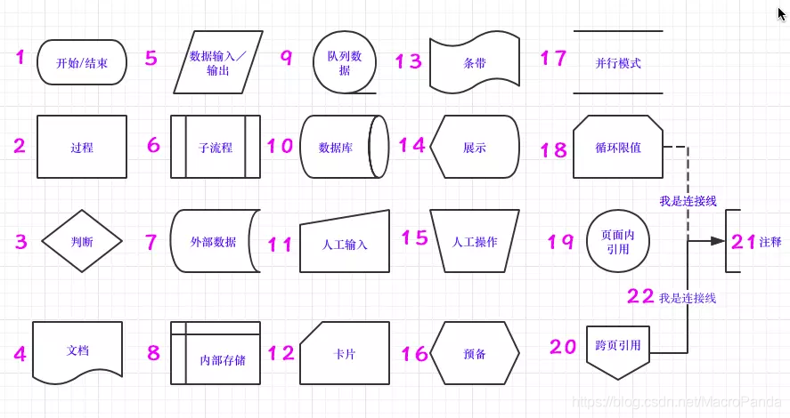

#### 1. 开始/结束

 作用：表示程序的开始或结束，在流程图中用作起始框或结束框。
 注意：并不是需要“开始”或“结束”这样的字眼才算是开始或结束，比如：注册和提交也能算是程序的开始和结束。

#### 2. 过程

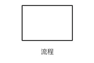
 作用：一般用作要执行的处理或过程，在流程图中用作执行框。

#### 3. 判断

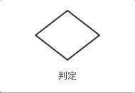
 作用：表示决策或判断（例如：If…Then…Else…），在流程图中用作判断框。

#### 4. 文档

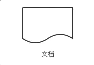
 作用：表达为一个文件，可以是生成的文件，或者是调用的文件。如何定义，需要根据实际情况进行解释。

#### 5. 数据输入/输出

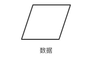
 作用：代表数据的输入/输出系统，包括接收数据和显示已处理的数据。数据只能先输入后输出，反过来是不可以的。

#### 6. 子流程

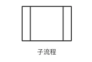
 作用：这个部件出现在比较复杂的流程图里，该节点是复杂流程图里的一个小流程。当然，它代表的也是一个单独流程，如提交订单流程。

#### 7. 外部数据

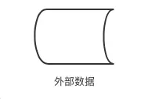
 作用：该部件表示数据来自外部，换句话说，数据是从外部引入的，比如引入微信的数据。

#### 8. 内部存储

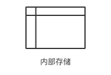
 作用：该部件是指数据提交之后，需要写入数据库。

#### 9. 队列数据

 作用：表示数据处理的一种方式，先进先出，类似排队买饭，站在队伍前边的人先买到饭，先离开队伍。至于处理后的数据要不要写入数据库，要具体情况具体分析。

#### 10. 数据库

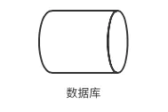
 作用：该部件表示从数据库中获取数据信息。

#### 11. 人工输入

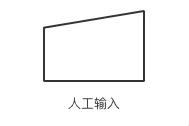
 作用：表示用户通过计算机键盘手动输入的数据。

#### 12. 卡片

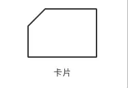
 作用：一般用于系统流程图中。

#### 13. 条带

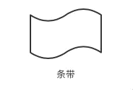
 作用：一般用于系统流程图中。

#### 14. 展示

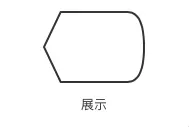
 作用：在网站或者设备上展示的信息，比如首页轮播图、商品详情页等。

#### 15. 人工操作

 作用：表示需要用户手动操作调整的内容，比如修改、搜索、删除、提交等。

#### 16. 预备

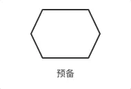
 作用：进入流程前的准备状态，一般用在起始框之前，也有人将这个用作起始框。

#### 17. 并行模式

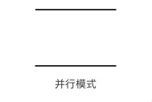
 作用：一般用于程序流程图中，表示两个流程或一个流程的两部分或几部分是同时进行的。在并行模式的框内可以添加其它的部件。

#### 18. 循环限值

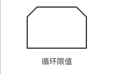
 作用：循环限值是指循环开始或结束的条件。有的地方是以去掉的角的位置来要区分循环开始和循环的结束。去掉矩形上面的两个角的是循环的上界限，代表循环的开始；去掉矩形下面两个角的是循环的下界限，代表循环的结束。
 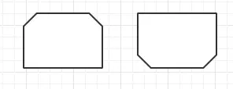

#### 19. 页面内引用

 作用：相当于一个页面内的跳转，从而使流程或者流程中的一部分形成一个闭环。

#### 20. 跨页引用

 作用：相当于一个跨页的连接器，实现跨页的引用和跳转。

#### 21. 注释

 作用：表示流程图的解释和说明，本身不会影响流程的进行。不同软件，针对流程图的注释形状有所差异，有的软件用虚线代表注释。

#### 22. 连接线

 作用：连接线一定是从一个部件开始到另一个部件结束，它表示了信息的流向。连接线可以是实现，也可以是虚线。虚线的含义需要具体情况具体分析。

## **三、程序流程图样例**

#### 1. 绘制一个流程图找出前50个自然数的总和。

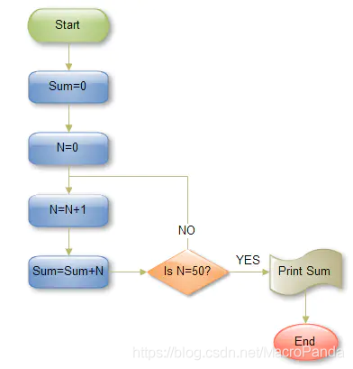

#### 2. 绘制一个流程图找出 A、 B、 C 三个数中大的一个数。

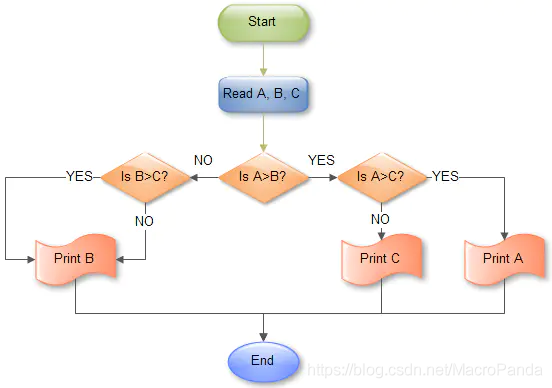

#### 3. 绘制一个流程图用于计算 N的阶乘。

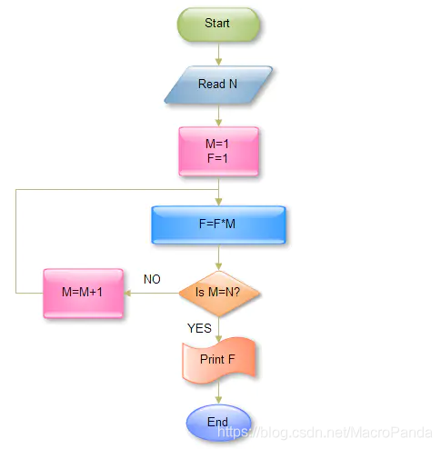

## **四、系统工作流程图样例**

一个游戏机制造商的产品装配分队正寻找组建产品更高效的方法。于是他们就把整个装配过程分成一系列的流程图，这个流程图显示了半成品组装和后成品的形成。改进前和改进后过程流程图显示如下：
 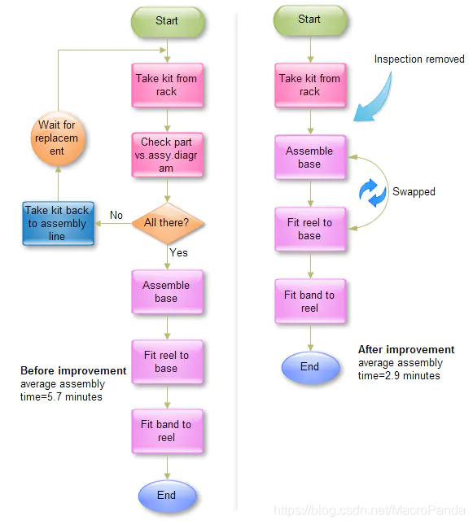
 作者：夏海峰
 链接：https://www.jianshu.com/p/11403115700a
 来源：简书
 著作权归作者所有。商业转载请联系作者获得授权，非商业转载请注明出处。