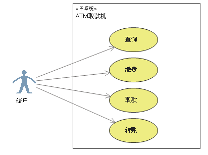
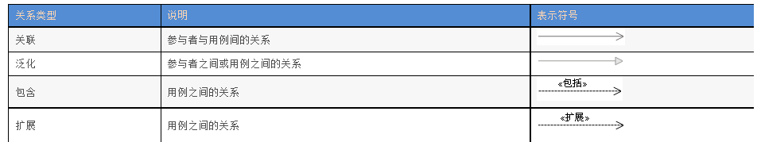

# UML用例图

参考链接：

[UML用例图总结](https://blog.csdn.net/tianhai110/article/details/6369762)

[UML-用例图](https://blog.csdn.net/qq_35507234/article/details/84893380)

[UML之用例图](https://www.cnblogs.com/gd-luojialin/p/10356704.html)

[详解 UML 用例图画法 & 用例说明方式](https://baijiahao.baidu.com/s?id=1661400666935924580&wfr=spider&for=pc)

## 什么是用例图

主要用于描述系统的行为及各种功能之间的关系，是描述参与者（Actor）与用例以及用例与用例之间关系的图。 

## 用例图有什么用

1. 捕获需求。描述功能需求、行为需求（系统要完成什么任务）

2. 分析需求。明确类和对象，建立之间的关系
3. 用于向开发、测试同事说明需求中用户与系统功能单元之间的关系。
4. 描述系统的功能。
5. 系统、子系统或类与外部参与者（actor）交互的动作序列的说明。

## 基本元素

### 1.参与者（Actor）

参与者是用例的启动者，处于用例的外部并且能够初始化一个用例，是系统外部的参与者，可以是用户、外部硬件、其他系统。

#### 怎么识别参与者： 

通过对参与者进行关注和分析，我们可以把重点放在如何与系统交互这一问题上，便于进一步确定系统的边界。另外，参与者也决定了系统需求的完整性。

- 谁向系统提供信息？
- 谁从系统获取（使用）信息？
- 谁操作这个系统？
- 谁维护这个系统？
- 系统要使用哪些外部资源？（系统启动打印机、扫描仪）
- 系统是否和已经存在的系统交互？（跨行转账的外部银行系统、时间到了定时启动系统某功能）

#### 系统中的参与者一般可以分为四类：

- 主要业务参与者：主要从用例的执行中获得好处的关联人员。

- 主要系统参与者：直接同系统交互以发起或触发业务或系统事件的关联人员。

- 外部服务参与者：响应来自用例的请求的关联人员。

- 外部接收参与者：从用例中接收某些价值或输出的非主要的关联人员。

### 2. 用例（Use Case）

用例就是外部可见的系统功能，对系统提供的服务进行描述。 用椭圆表示

#### 用例与参与者的关系

一个用例可以隶属一个或多个参与者，一个参与者也可以参与一个或多个用例。用例与参与者之间存在关联关系。

主参与者与次参与者：通常来说主参与者是用例的重要服务对象，而次参与者处于一种协作地位。

#### 用例的特征

用例的特征保证用例能够正确地捕捉功能性需求，同时也是判断用例是否准确的依据。

1）用例是动宾短语

2）用例是相对独立的

3）用例是由参与者启动的

4）用例要有可观测的执行结果

5）一个用例是一个单元

### 3.子系统（Subsystem）

用来展示系统的一部分功能，这部分功能联系紧密。

### 4.关系

用例图中涉及的关系有：关联、泛化、包含、扩展；

#### 1) 关联**（accociation）**

每个用例都有活动者启动（每个用例必须和一个活动者关联，有一个活动者来参与），除包含和扩展用例 无论用例和活动者是否存在双向数据交流（无论是参与者提供信息给系统，还是从系统获取信息），关联总是由活动者指向用例，只用单向箭头。

#### 2) 泛华**（generalization，继承）**

泛化关系是两个用例或者两个参与者之间的关系。一个用例和其几种情形的用例间构成泛化； 往往将父用例用抽象用例（abstract）表示（即，父用例往往是虚的，真正用的是子用例。）

#### 3) 包含**（include）**

包含是一种依赖关系，加了版型`<<include>>`，两个以上用例有共同功能行为，可单独抽象成一个单独用例，形成包含依赖； 箭头方向由基本用例指向被包含用例； 执行基本用例时，每次都必须调用被包含的用例（吃饭前洗手）； 被包含用例也可以单独执行；

**注意**：一个用例功能过多，可分解成小用例，构成包含依赖 本例中，被包含用例不能单独执行，没有Actor直接指向它们

#### 4) 扩展**（extend）**

扩展是一种依赖关系，加了版型`<<extend>>` 一个用例（在某些扩展点extension point上）扩展另一个用例的功能，构成新用例；箭头方向由扩展用例指向被扩展用例（即基本用例）； 扩展用例依赖于被扩展用例（基本用例），只是部分片段组成，不是完整的独立用例，无法单独执行； 扩展用例不一定每次都被执行和调用。（吃饭前也可以不洗手），而被包含用例每次必修执行。 肯定没有活动者指向扩展用例，因为扩展用例依赖基本用例。

## 用例建模的步骤

#### 对系统的语境建模

　　识别系统边界。

　　识别参与者。

　　如果需要，将具有相同特征的参与者使用泛化关系加以组织。

　　如果需要，对某些参与者应用一个构造型以便加深理解。

　　将参与者应用到用例图中，并描述参与者与用例间的通信路径。

#### 对系统的需求建模

　　识别参与者。

　　对于某个参与者，考虑其期望系统提供的行为或与系统的交互。

　　将行为提炼成用例。

　　完善其他用例。分解用例中的公共行为与扩展行为，放入新的用例中以供其他用例使用。

　　创建用例图。

　　如果需要，在用例图中添加一些注解或约束来陈述系统的非功能需求。

## 用例图使用要点

1.构建结构良好的用例。用例图中应该只包含对系统而言必不可少的用例与相关的参与者。

2.用例的名称不应该简化到使读者误解其主要语义的程度。

3.摆放元素时应尽量减少连接线的交叉，以提供更好的可视化效果。

4.组织元素时应使在语义上接近的用例和参与者在图的位置上也同样接近，便于读者5.理解用例图。

5.可以使用注解或给元素添加颜色等方式突出图中相对重要的内容。

6.用例图中不应该有太多的关系种类。

## 用例描述

用例描述概述：一个完整的用例模型应该不仅仅包括用例图部分，还要有完整的用例描述部分。

 

一般的用例描述主要包括以下几部分内容：

用例名称：描述用例的意图或实现的目标，一般为动词或动宾短语。

用例编号：用例的唯一标识符，在其他位置可以使用该标识符来引用用例。

参与者：描述用例的参与者，包括主要参与者和其他参与者。

用例描述：对用例的一段简单的概括描述。

触发器：触发用例执行的一个事件。

前置条件：用例执行前系统状态的约束条件。

基本事件流（典型过程）：用例的常规活动序列，包括参与者发起的动作与系统执行的响应活动。

扩展事件流（替代过程）：记录如果典型过程出现异常或变化时的用例行为，即典型过程以外的其他活动步骤。

结论：描述用例何时结束。

后置条件：用例执行后系统状态的约束条件。

补充约束：用例实现时需要考虑的业务规则、实现约束等信息。

 

前置条件与后置条件

前置条件指的是用例执行前系统和参与者应处于的状态。前置条件是用例的入口限制，它便于我们在进行系统分析及设计的时候注意到，在何时何地才可以合法地触发这个事件。

后置条件是用例执行完毕后系统处于的状态。后置条件是对用例执行完毕后系统状况的总结，用来确保用户理解用例执行完毕后的结果，并非其他用例的触发器。

前置条件与后置条件分别是用例在开始和结束时的必要条件。

 

事件流

事件流是对用例在使用场景下的交互动作的抽象，应该包括用例何时以及怎样开始和结束，用例何时与参与者交互，该行为的基本流和可选择的流。

基本事件流：描述的是用例中最核心的事件流，是用例大部分时间所进行的场景。

扩展事件流：描述的是用例处理过程中的一些分支或异常情况。

 

补充约束

补充约束用来描述用例在系统功能之外的内容，例如非功能需求、业务规则等等。

数据需求：与该用例相关的一些数据项的说明。

业务规则：与业务相关的逻辑和操作规则。

非功能性需求：例如性能、支持的并发量等。

设计约束：是从多个角度对用例或系统的约定。

### 用例文档实践

|    用例名称    | **提交订单**                                                 |
| :------------: | :----------------------------------------------------------- |
|  **用例编号**  | UC002                                                        |
|   **参与者**   | 会员                                                         |
|  **用例描述**  | 该用例描述一个系统会员提交一份订单的行为                     |
|   **触发器**   | 当订单被提交时，用例触发。                                   |
|  **前置条件**  | 提交订单的一方需要完成登录操作                               |
|  **后置条件**  | 如果订单中的商品有库存，则发货；否则提示用户当前缺货         |
| **基本事件流** | 1 参与者将订单信息提交至系统。2 系统验证用户信息及订单信息合法后作出响应。3 对于订单中的每种产品，系统根据订单中的数量检查产品库存数量。4 系统统计订单中产品的总价格。5 系统从会员的系统账户余额中扣除相应金额。6 系统生成并保存订单信息并将订单发送至分销中心。7 系统生成订单确认页面并发送给会员。 |
| **扩展事件流** | A-2 如果订单信息非法，系统通知会员并提示重新提交订单。A-3 如果订单中产品数量超过产品库存量，则提示会员库存不足，暂无法购买，取消订单同时终止用例。A-5 如果会员账户余额不足，系统给出相应提示，取消订单并终止用例。 |
|    **结论**    | 当会员收到系统发送的订单确认页面或其他异常信息时，用例结束。 |
|  **数据需求**  | D-1 订单信息包括订单号、参与者的会员账户名、商品种类数量、商品种类名称以及每种商品的数量。 |
|  **业务规则**  | B-1 只有当订单中商品信息确认无误后才能要求会员进行支付。     |

## 案例（1）学生选课系统

某学校的网上选课系统主要包括如下功能：

   管理员通过系统管理界面进入，建立本学期要开的各种课程，将课程信息保存在数据库中并可以对课程进行改动和删除。

   学生通过客户机浏览器根据学号和密码进入选课界面，在这里学生可以进行三种操作：查询已选课程，选课以及付费。

   同样，通过业务层。这些操作结果存入数据库中。

 

步骤：1。确定系统边界。2.确定参与者（名词）。3.确定用例（动宾结构）。4.确定关系（联系）

 

参与者：学生、教务人员、数据库

用例：选课、查询、支付课时费用、登陆、修改课程、添加课程、删除课程

关系：关联关系、泛化关系

