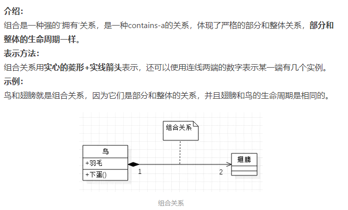

# UML类图

参考链接：

[维基百科-UML类图](https://zh.wikipedia.org/wiki/%E9%A1%9E%E5%88%A5%E5%9C%96)

[看懂UML类图和时序图](https://www.bookstack.cn/read/design-patterns/e1777f45836f23fa.md)

[UML类图](https://www.jianshu.com/p/57620b762160)

## 一般组成

- 最上面是类名称

- 中间部分包含类的属性

- 底部部分包含类的方法

  

## 封装

```
+   公共	public
-   私有	private
#   保護（即對子類可見）protect
~   包（即對包内其他成員可見）	
```

## 关联


### 单向关联

两个类是相关的，但是只有一个类知道这种联系的存在


如图对于单向关联表示为一条带有指向已知类的开放箭头实线，单向关联只包含一个角色名和多重值，一个人可以有0个或者多个账户，人可以感知到账户的存在，但是账户却感知不到人的存在。

### 双向关联

对于双向关联来说被关联的两个类可以感知对方的存在


如图在线每端放置一个角色和多重值，对于Route来说我们应该看在bike端的角色和多重值，对于Route来说每个骑行路线对应0个或者多个自行车，0个是因为可能先制定了骑行路线但是还没有找到自行车，多个是因为可以有多个人骑行同一个路线。对于bike来说我们应该看route端的角色和多重值，对于一个bike来说每个自行车对于0个或者多个骑行路线，0个是因为虽然有一个自行车但是我可以不骑行，不指定骑行路线那，多个是因为我一个自行车可以指定多个骑行路线。

## 接口和抽象类

名字上面放这些东西

```
接口 <<interface>>

抽象类  <<abstract>>
```

## 示例

这个例子是我从第二个文章中找的，没有方法，属性


- 车的类图结构为<>，表示车是一个抽象类；
- 它有两个继承类：小汽车和自行车；它们之间的关系为实现关系，使用带空心箭头的虚线表示；
- 小汽车为与SUV之间也是继承关系，它们之间的关系为泛化关系，使用带空心箭头的实线表示；
- 小汽车与发动机之间是组合关系，使用带实心箭头的实线表示；
- 学生与班级之间是聚合关系，使用带空心箭头的实线表示；
- 学生与身份证之间为关联关系，使用一根实线表示；
- 学生上学需要用到自行车，与自行车是一种依赖关系，使用带箭头的虚线表示；下面我们将介绍这六种关系；

## 类之间的关系


### 继承关系（泛化关系）（generalization）- 继承非抽象类

继承关系为 is-a的关系；两个对象之间如果可以用 is-a 来表示，就是继承关系：（..是..)

eg：自行车是车、猫是动物

继承关系用一条带空心箭头的直接表示；如下图表示（A继承自B）；


在现实中有实现，可用汽车定义具体的对象；汽车与SUV之间为泛化关系；


### 实现关系 （realize）- 继承抽象类

实现关系用一条带空心箭头的虚线表示；

eg：”车”为一个抽象概念，在现实中并无法直接用来定义对象；只有指明具体的子类(汽车还是自行车)，才可以用来定义对象（”车”这个类在C++中用抽象类表示，在JAVA中有接口这个概念，更容易理解）


### 聚合关系(aggregation)

聚合关系用一条带空心菱形箭头的直线表示，如下图表示A聚合到B上，或者说B由A组成；


聚合关系用于表示实体对象之间的关系，表示整体由部分构成的语义；

例如一个部门由多个员工组成；

**与组合关系不同的是，整体和部分不是强依赖的**，**即使整体不存在了，部分仍然存在**；例如，部门撤销了，人员不会消失，他们依然存在；


### 组合关系（composition）

组合关系用一条带实心菱形箭头直线表示，如下图表示A组成B，或者B由A组成；


与聚合关系一样，组合关系同样表示整体由部分构成的语义；比如公司由多个部门组成；

但组合关系是一种强依赖的特殊聚合关系，如果整体不存在了，则部分也不存在了；例如，公司不存在了，部门也将不存在了；



### 关联关系（association）- 内部类、成员变量

关联关系是用一条直线表示的；它描述不同类的对象之间的结构关系；它是一种静态关系，通常与运行状态无关，一般由常识等因素决定的；它一般用来定义对象之间静态的、天然的结构；所以，关联关系是一种“强关联”的关系；

比如，乘车人和车票之间就是一种关联关系；学生和学校就是一种关联关系；

**关联关系默认不强调方向，表示对象间相互知道；**如果特别强调方向，如下图，表示A知道B，但B不知道A；


**注：在最终代码中，关联对象通常是以成员变量的形式实现的；**


### 依赖关系(dependency) - 类构造方法及类方法的传入参数

依赖关系是用一套带箭头的虚线表示的；如下图表示A依赖于B；他描述一个对象在运行期间会用到另一个对象的关系；


**与关联关系不同的是，它是一种临时性的关系，通常在运行期间产生，并且随着运行时的变化；依赖关系也可能发生变化；**

显然，依赖也有方向，双向依赖是一种非常糟糕的结构，我们总是应该保持单向依赖，杜绝双向依赖的产生；

注：在最终代码中，依赖关系体现为类构造方法及类方法的传入参数，箭头的指向为调用关系；依赖关系除了临时知道对方外，还是“使用”对方的方法和属性；

